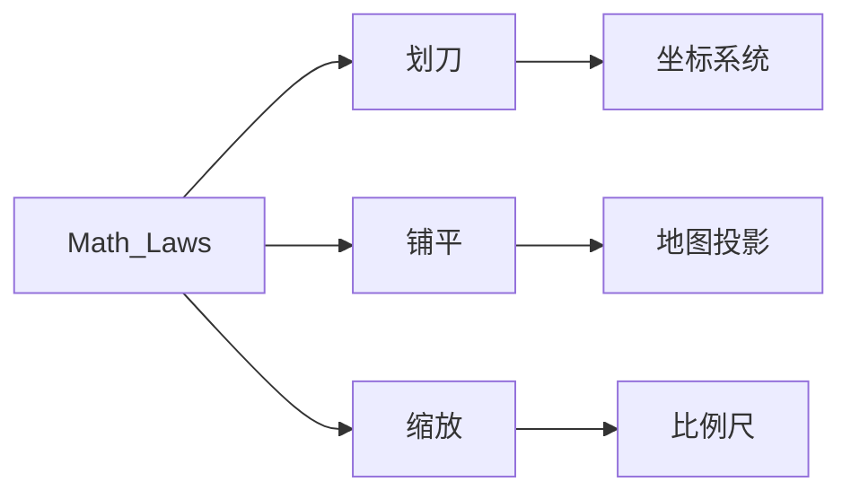
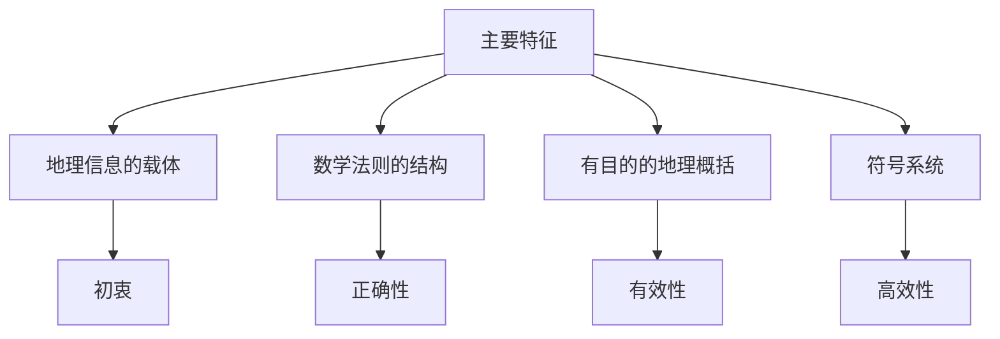
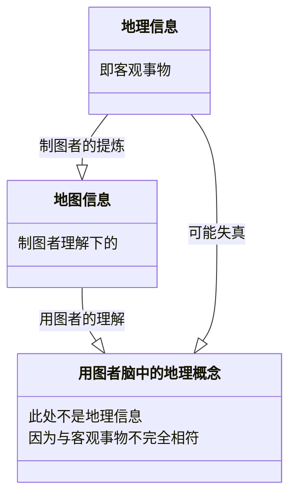
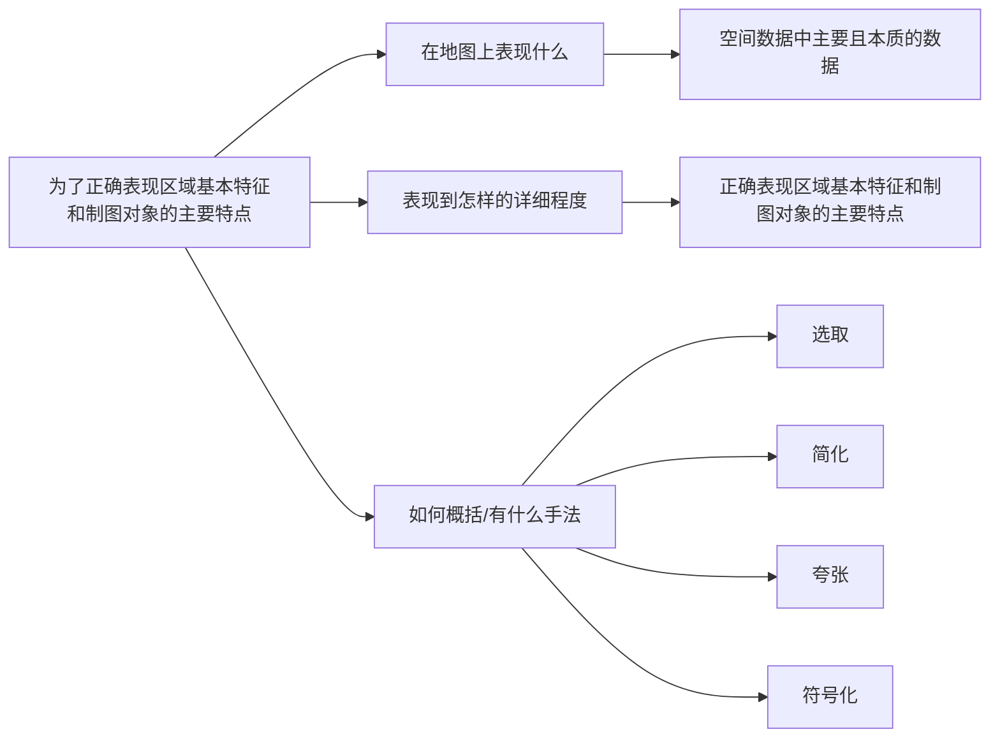
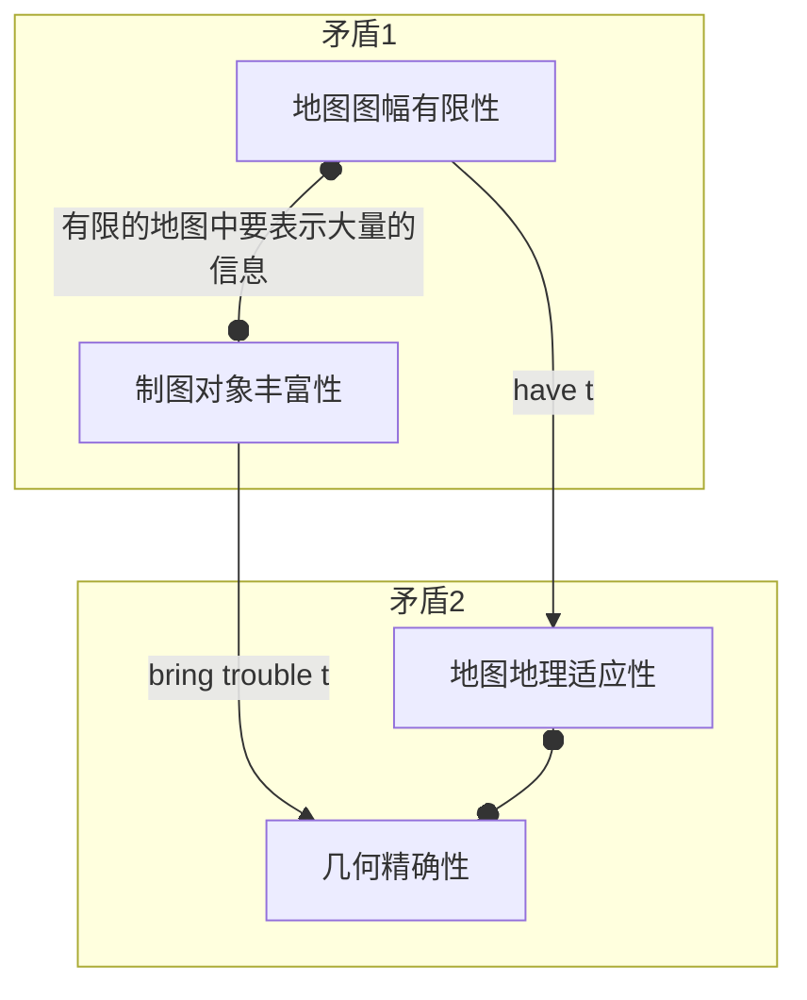
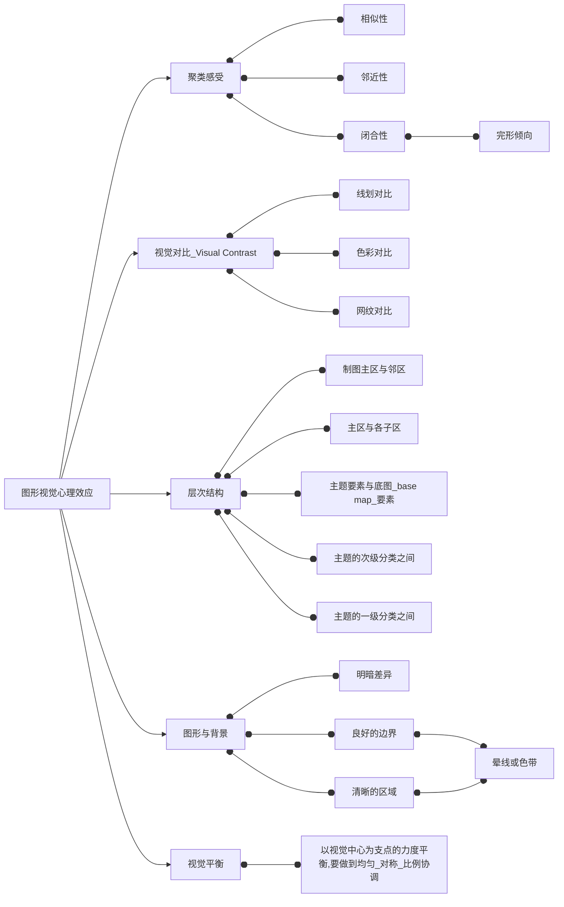

# 地图学

　　我的目标是掌握地图学的思想和技术，思想是一条线，把所有的技术串联起来。

　　顺便通过这个markdown的写作掌握latex的公式运用（在投影那里应该有适量的数学公式）。

## 0 为什么要学习地图学

　　其实陆漱言先生和陈述彭先生说得很对，值得多多品读。

### 0.1 信息科学与地理结合的学科

> 全书贯穿了地图—可视化—信息化的学科体系。

### 0.2 全书脉络梳理

（2022-2-26）

　　今天第一次做梳理，目前只上了一节课，所以我的判断可能不准。

　　我将第一章导论改为“地理学的第二语言——地图”，这样第一章就是侧重地图学思想的一章。第2章是地图的数学基础，或者说是给地球进行数学建模。第3～6章是信息科学的入门。第7～11章是制作地图的实践。

　　可见，专门讲思想的只有一章，我必须要在实践中领悟思想。

## 1 地理学的第二语言——地图

### 1.1 地图的基本概念

#### 1.1.1 地图的主要特征

* 地理信息的载体

​		表达空间序列、**时间序列**以及各现象间的相互联系，从而了解制图对象的历史进程、现代发展和未来趋势。*这体现研究地图的初衷是研究地理信息。*

* 数学法则的结构

　　将地球表面划几刀形成各个区域和交点，再铺平，最后缩放。*数学法则确保`地理信息-->地图信息`的正确性。*

* 有目的的地图概括

　　地理信息海量，吾辈但取一瓢`概括=分类+简化+夸张+符号化`。*地图概括确保`地理信息-->地图信息`的有效性。*

* 符号系统的使用

> 地图是符号的模型

　　*符号系统确保地图信息流通的高效性。*

#### 1.1.2 地图的主要功能

　　在上一节我推理出每个特征对应一个性质：

　　但这毕竟不是功能，这只是特征围绕`地理信息-->地图信息`这一初衷而衍生的性质。

　　谈及功能时，关注的不仅仅是地图本身，还应该主要从使用者的角度出发，使用者又可以分为制图者和用图者。

* 地图的认知功能
* 地图信息的载负功能

　　地图信息是地图符号`直接信息`及其组合后的内容、意义和观念`间接信息`。

* 地图的传递功能

* 地图的模拟功能

  >  地图是符号的模型

  　　模拟依靠模型，地图这一模型可以分为物质模型和概念模型。

  * 物质模型

  　　物质模型基于地理要素（如水系、居民点）。

  　　随着数字孪生、GMS、地球空间信息学等新技术、新学科的发展，物质模型的作用逐渐提升。

  * 概念模型

　　　　概念模型是基于物质模型，对实体的抽象和概括。

#### 1.1.3 地图定义的讨论

　　地图是遵循相应的数学法则，经过科学的概括，利用符号系统表示的地理信息载体，*以传递地理信息的数量和质量在空间和时间上的分布规律和发展变化*。

　　此处我的直觉得到一点修正：创造地图的初衷是`地理信息-->地图信息`，但是在时间的过程中，使用地图的目的不仅仅只有初衷一条，还增加了`分析时空的历史、现状和未来`。

### 1.2 地图的成图方法

* 实测成图法
  * 野外地形测图
  * 摄影测量成图
* 编绘成图法
  * 常规编图
  * 遥感制图
* 数字制图法

### 1.3 地图的分类

#### 1.3.1 地图的类别

* 按区域范围划分
  1. 星球图、地球图
  2. 世界图、半球图、大洲图、大洋图
  3. 国家图、下属行政区图
  4. 局部区域，如海湾图、流域图

* 按缩小的程度（比例尺）划分
  * 大比例尺
    大于1:10w
  * 中比例尺
    1:10w～1：100w
  * 小比例尺
    小于1:100w

> 不过比例尺的大小是相对的，城市规划常用1:5k～1:1w

* 按地图的图型划分

  * 普通地图

    > 表示自然地理和社会经济的一般特征的地图

    * 地形图
    * 地理图（一览图）

  * 专题地图

    > 着重表示一种或多种*主题*要素的相互关系的地图

    * 医学地图

  * 专用地图

    > 有特别用途的普通地图或专题地图

    * 航空图
    * 海图
    * 教学图
    * 旅游图

  * 特种地图

    * 地球仪
    * 地形模型

* 按地图的维数分类

  * 平面地图（2维）

  * 立体地图（3位）

    > 利用视差原理

    * 互补色地图
    * 光栅地图
    * 立体+VR-->“可进入”立体视觉新品种

#### 1.3.2 地图的多种形态

* 心象地图
* 模拟地图
  经过人工抽象和符号化的地图，以纸质、丝绸等为载体
* ……

> 个人觉得这些分类不是很有价值。

## 2 地球体与地图投影

### 2.1 地球体

#### 2.1.1 地球体的基本特征

##### 古人测量方法

> 了解这个过程有利于学以致用，毕竟日常生活中没有高科技就和古代差不多，而这恰恰能体现素养。
>
> 如果连古人的思想历程都不了解，那么学的现代技术就是空中楼阁。

| 时间      | 事件                         | 意义&方法                                                  |
| --------- | ---------------------------- | ---------------------------------------------------------- |
| 3 B.C.    | 塞伊尼的阳光水井             | **人类第一次采用L=θR弧长公式（弧度测量概念）测量地球大小** |
| 8 A.C.初  | 张遂的三件套（原理还是L=θR） | 最早对地球大小进行实测，**采用四个“台站”**                 |
| 827年     | Al Mamum教主看星星           | 从太阳高度角推广到恒星高度角                               |
| 17 A.C.末 | Newton降维打击证明椭球       | **天文学和物理学引入**                                     |
| 1735年    | 法国1735测量队               | **严谨的大地测量学引入**，实测证明是椭球体                 |

##### 地球形状概括

地球是一个极半径略短、赤道半径略长、北极略突出、南极略扁平的（梨形）椭球体。

##### 现代精密测度技术

* 天文大地测量
* 地球重力测量
* 卫星大地测量

##### 地球的三个表面

* 自然表面

* 物理表面

  > 大地水准面

  * 处于流体平衡状态下的静止海平面延伸
  * 其实也是重力等位面

* 数学表面

  > 地球椭球体

  * 三要素
    * 半长轴a
    * 半短轴b
    * 扁率α=(a-b)/a
  * 发展历程
    * 克拉索夫斯基椭球体
    * 1975 IUGG椭球体
    * WGS-84椭球体

#### 2.1.2 地理坐标

* 天文经纬度

  > 以铅垂线为基准

* 大地经纬度

  > 以法线（垂直于地球椭球面）为基准

* 地心经纬度

### 2.2 对地观测系统

#### 2.2.1 大地坐标系统

**椭球体定位**

* 地心坐标系
  现代卫星定位常用

  * 美国国防部WGS1984

    > 服务于美国GPS定位系统 

  * 2000国家大地坐标系

    > 服务于北斗卫星定位

* 参心坐标系
  将参考**椭球体**平移、旋转、缩放，使得在某一个**坐标原点**附近椭球面与水准面大致吻合，所以得到的是一个“参考的地心”，较传统，只能局部吻合

  * 北京54大地坐标系统

    > 误差很大。

    * 克拉索夫斯基椭球
    * 名义上坐标原点在北京，但考虑到这只是苏联1942坐标系的延伸，所以本质上的坐标原点还是在普尔科沃

  * 西安80大地坐标系统

    * 采用GRS1975参考椭球体

      > GRS1975是国际大地测量与地球物理学联合会IUGG1975年推荐的。

    * 坐标原点位于西安市泾阳县境内，位于我国居中位置，可以减小测量过程中的坐标传递误差

#### 2.2.2 大地控制网

在全国范围内选取若干有控制意义的观测点，建立和维护高精度的全国测量系统。

##### 平面控制网

三角形是基本单位，利用曲面上的正弦定理。通常尽量保持等边，记边长为a

* 一等三角锁
  * 平面控制网的骨干
  * a=20~25km
  * 锁段长200km
* 二等三角网
  * a=13km
* 三等三角网
  * a=8km
* 四等三角网
  * a=4km

​	

##### 高程控制网

我国水准原点：青岛观象山，推算黄海平均海平面作为高程起算面。（其实原点有从深井往上移H0=72.260m,叫做水准原点高程）

* 1956黄海高程系统
  * H0=72.289m
* 1985国家高程基准（目前我国统一采用）
  * H0=72.260m

#### 2.2.3 全球导航卫星系统GNSS

##### 以GPS为例

* 空间星座
  * 24颗卫星
  * 6个轨道面
* 地面控制系统
* 用户接收装置

##### 为什么一个位置同时需要4颗卫星

三个空间距离公式里一共有x,y,z三个未知数，再加上∆t，共有4个未知数

### 2.3 地图投影

### 2.4 地图比例尺

## 3 地图概括

### 3.1 概述

#### 3.1.1 地图概括的实质

##### 何为地理概括

地图概括是对地理信息从感知到理性认知的抽象过程。

> 我的直觉就是这样，地图概括不仅仅是地图缩放过程中的，它是地理信息的抽象过程。
>
> 不过，地理信息的抽象过程，即从实地到地图，不正是一种缩放吗？只不过其中有从实到虚的质变罢了。

##### 地理概括中的矛盾

地理概括的意义就是协调两大矛盾：

#### 3.1.2 影响地图概括的因素

* 用途与主题

  * 跟我主题相关的才要详细表示
  * 用途也包括地图的受众
    * 科普读者、中小学生
    * 专家学者
      * 地质学家
      * 气象学家
      * GISer

* 地图比例尺

  * 地图详细程度的主要决定者

* 制图区的地理特征

  * 地理适应性
  * 同一要素在不同地区的地位和意义不同
    * 水系
    * 等高距
    * 居民点

* 数据质量

  * 数据源的精度应当**高于**新编地图的精度

* 图解限制

  > 人眼对图形、符号的解读

  * 尺寸
    * 地图的用途
    * 对图形定位精度的要求
    * 人眼识别能力
    * 心理感受效果

### 3.2 模拟地图的概括内容与方法

### 3.3 地图概括的现代发展

## 4 地图符号设计

### 4.4 色彩

> * 初始直觉
>   * 信息较多-->信息表示效率更高
> * 补充
>   * 对比度更明显

#### 4.4.1 色彩的作用

1. 简化图形符号系统

   1. 用颜色变量代替形状变量
   2. 尤其是多层次的情况，防止只用一种视觉变量导致枯燥

2. 提高了地图内容表现的科学性

   1. 加强地图要素分类、分级系统的直观性

      > 能讲出一个道理来

3. 改善地图语言的视觉效果

   1. 整体感
   2. 差异感
   3. 等级感
   4. 层次感

4. 提高审美价值

#### 4.4.2 色彩的三属性

1. 色相(Hue)

   1. 可见光光谱`380nm-780nm`

   2. 人眼区分色相的精度`2-4nm`

   3. 常把光谱弯曲成一个环

      1. 产生`红+紫=品红`

      2. 对角线的颜色对比度最大

      3. 红、绿、蓝三原色成为等边三角形的三个顶点

      4. 两个颜色混合的结果是中间的颜色

         > 不得不说，这是很好的数学性质。

      5. 同类色`0-15`、类似色`15-30`、邻近色`30-60`、互补色

   4. 色彩的混合规律

      1. 色光`加色法`
         1. 越加越亮(被反射的光越来越多，体现`加色`)
         2. 电子屏幕都是加色法
         3. 互补色混合就是白光
            1. `绿+蓝=青，青=-红`，所以`青+红=白`
      2. 色料`减色法`(色料是颜料，不是光)
         1. 黄颜料+品红颜料=红颜料
         2. 越加越暗(被吸收的光越来越多，能反射的越来越少，体现`减色`)

      > 以上混合默认等量混合。

      *我对不等量混合很感兴趣：究竟是向量割圆法还是角度等比法？*

2. 亮度(Brightness&value)，也称明度

3. 彩度(Saturation)，也称饱和度或纯度

   1. 表示接近光谱的程度
   2. 彩度越高越艳丽，混入的灰色更少
      1. 0%饱和度就是纯灰色
      2. 100%饱和度就是光谱色

#### 4.4.3 色彩的表示

1. 芒塞尔色立体
   1. 切向是色相
   2. 法相是彩度
   3. z方向是亮度
2. 色谱和色库(`和`表示混合)
   1. 色谱
      1. 建立在四色印刷基础上的表示系统
         1. `黄、品红、青、黑`是彩色印刷的基本色
3. 计算机表色系统
   1. RGB模型(正方体模型)
      1. 三个分量都是`0-255`
      2. 适用于web或者APP
   2. HSB模型
      1. `Hue`0-360
      2. Saturation
      3. Brightness
   3. CMYK模型`印刷四色`
      1. __C__yan青
      2. __M__agenta品红
      3. __Y__ellow黄
      4. Blac__k__黑

#### 4.4.4 地图用色设计

1. 定性特征的设色
   1. 考虑色彩的生理与心理感受
      1. 心理感受
         1. 冷暖感
            1. 应用于等温线、寒暖流
            2. 注意：绿、品红都是中性色
         2. 轻重感
            1. 主要和亮度有关系
         3. 华丽感与朴素感（主要看彩度，亮度其次）
            1. 高彩度-->华丽
            2. 低彩度-->朴素
      2. 生理感受
         1. 远近感
            1. 不同波长的光在晶状体折射角度不一样，成像位置不一样
            2. 前进色`红、橙、黄`
   2. 地图用色数量的限制
   3. 正确应用色彩的象征性
      1. 紫-->忏悔、女性🚺-->神秘感、女性化
      2. 蓝-->天空、海洋、信念-->冷静、智慧开阔
   4. 遵循用色习惯与标准
2. 定量特征的设色
   1. 单色渐变
      1. H不变，SB变
   2. 双色渐变
      1. 产生了质变(一般用H改变来体现)
   3. 多色渐变
      1. 地势分层设色图

### 4.5 符号与图形的心理感受特点

#### 4.5.1 视觉变量的感受效果

六种视觉变量：形状、方向、色相、网纹、亮度、尺寸

* 只有尺寸有**数量感**
* 只有网纹、亮度、尺寸有**次序感**
* 六种能产生**差异感**
  * 选择感
  * 组合感

##### 什么是选择感？

能产生映射，如黄色对应黄种人聚集区。

##### 什么是组合感？

内部各区块有差异，但给人一种整体的感受

> 亮度、彩度比较接近。

#### 4.5.2 图形视觉的心理效应

格式塔心理学派经大量实验总结出的*构图法则*。

#### 4.5.3 视分辨力的限度

### 4.6 注记

#### 4.6.1 注记的意义和种类

注记是地图上标注的各种文字和数字，也是一种地图符号。

> 各种视觉变量形成了整体认知，注记是*临门一脚*。

* **地名注记**
  * 山脉、河流、居民点、岛屿、海洋等地理事物的名称
    * 避免
      * 有地无名
      * 有名无地
      * 错误标注
      * 地名混乱
    * 国际通用名
    * 跨国的河流、山脉⛰️
* **说明注记**
  * 说明地理事物的种类、性质或特征
    * 采石场
    * 桥载重
    * 等高线
* **图幅注记**
  * 地图的编制状况
    * 地形图的分幅编号

#### 4.6.2 注记的设计

1. 注记的排列和布置

   1. 字列

      1. 水平字列
      2. 垂直字列
      3. 雁行字列
      4. 屈曲字列

   2. 带状或线状的注记在同侧

   3. 面状要划对角线判断

   4. 点的优先次序

      1. | 7    | 3    | 5    |
         | ---- | ---- | ---- |
         | 2    | ⭕️    | 1    |
         | 8    | 4    | 6    |

2. 注记字体、尺寸和颜色

   1. 颜色
      1. 居民地黑色
      2. 水系蓝色
      3. 地貌棕色
      4. 植被绿色
   2. 尺寸
      1. 地物重要程度
   3. 字体

## 5 地图表示法

> 老师的课件标题是`第五章 地图表示法`

> 单个的符号传达不了空间区域的整体信息，一副完整的地图要依据一定的符号组织规则，在各个层面上以符号的组合反映制图对象在特定区域内的空间分布特征，从而构成客观世界的形象-符号模型。
>
> ——A.H. 鲁滨逊

### 5.1 点状分布地理数据的表示

#### 5.1.1 用定位符号表示定性数据

> 点状定位符号法=定点符号法
>
> 区分事物的性质

有哪些点状符号：

* 形状变量
  * 几何
  * 象形
  * 文字
* 颜色变量（色相）
* 结构（网纹）变量
* 方向变量

> 传统地图多用形状变量中的几何符号，文字、象形用的少，现代地图不然。因为电子地图可以交互式缩放，且绘图能力强。

如果点状符号要处理**多层次的分类体系(Visual Hierarchy)**，几个层次就用几个变量。例如矿产分类：

1. 形状
2. 色相
3. 结构or方向

#### 5.1.2 用定位符号表示定量数据

> 尺寸变量
>
> 定位比率符号法。

用什么样的点状符号：⭕️比例圆

* 便于分辨数值差异
  * 它是规则的几何符号
* 紧凑美观
  * 相同面积周长最小

##### 连续比率方式

绝对比率符号k

* L=kM
* k的确定
  * 极小值符号清晰可变
  * 极大值符号尺寸适宜

对绝对比率符号的改进

* 条件比率符号法

  * $$
    L=kM+b
    $$

* 线性比率法

* 对数法

  * 相差很大时，尤其是差好几个数量级

* 心理比率法

  * $$
    L=kM^{0.57}
    $$

  * 心理物理学实验发现，人们对符号间面积差异的视觉估计普遍低于其代表数值的实际差异

    

##### 分级比率方式

地理区位、自然条件决定有些数量具有相似性，自发地形成了多个等级。

仍需心理物理学：区别明显、过渡自然。

#### 5.1.3 用定位符号表示地理数据的结构和变化

> 定位图表法

##### 点状符号拓展

> 即便符号再大再复杂，只要表示一个点的位置的信息，就是点状符号。

二维图形扩展

* 分割圆
* 金字塔图表
* 坐标统计图
* 玫瑰图

三维图形扩展（立体符号）

* 球状符号

  > 略有牵强，虽然是点状符号，但是不能展示结构和变化。

* 柱状符号

* 轴测图符号（等值图块图表）

  * 可以展示多个维度的结构占比

##### 点状符号定位处理

* 表示地理位置
* 表示地理范围内的信息

### 5.2 呈线状或带状分布地理数据的表示

#### 5.2.1 线状符号的特征

##### 定位特征

* 精确定位
* 概略定位

##### 状态特征

* 静态
  * 

以上成为**线状符号法**

* 动态
  * 线状符号表示路径
  * 箭头表示方向
  * 形状和颜色表示质量特征
  * 符号宽度表示定量特征

#### 5.2.2 线状符号的定性表示

##### 线性符号的表现形式（形状）

* 单线和平行双线
* 实线和虚线
  * 虚线
    * 非实物
    * 未完成
    * 不稳定或暂时性
* 对称线和非对称线
* 指向线
* 渐变线

#### 5.2.3 线状符号的定量表示

* 属性数据的量表
  * 顺序量表
  * 间距量表
  * 比率量表
* 视觉变量的选择
  * 尺寸或颜色变量中的亮度与彩度

#### 5.2.4 运动状态的线状表示

* **动线符号法**
  * 反应移动的起点和终点
  * 行进路线
  * 流向
  * 流量
    * 以宽度比率表示
  * 流速
    * 注记或其他视觉变量
  * 性状指标
  * 相互联系

### 5.3 呈面状分布地理数据的表示

#### 5.3.1 面状地理数据的定域表示

##### 空间分布形态

* 全域连续分布
  * 降水、气温、海拔高度、气候类型
* 局域成片分布
  * 灾害分布
* 离散分布
  * 珍稀动物

##### 精确区域和概略区域

* 精确区域
  * 行政分区、洪水淹没范围
* 概略区域
  * 金丝猴活动区域

#### 5.3.2 面状地理数据的定性表示

##### 表示方法

* **质底法**（质量底色法）
  * 特点
    * 线划表示分类或分区界线
    * 色相或网纹表示质量特征
  * 应用
    * 类型图
      * 无空白区域
      * 图斑互不重叠且类型具有排他性
    * 区划图
      * 图斑互不重叠且无空白区域
* **范围法**
  * 特点
    * 用轮廓线、颜色、晕线、注记及符号等方法在地图上表示制图对象的分布范围及其状况
  * 应用
    * 分布图
      * 可以重叠
      * 有精确定域和概略定域之分

##### 定性信息的处理程序

1. 类型调查
   1. 以前需要实地调查
   2. 现在可以通过遥感分析
      1. 真彩色
      2. 假彩色
         1. 近红外等不同波段合成
2. 数据的分类和升级
   1. 多层次分类体系——不同层次对应不同视觉变量
      1. 面状符号以颜色变量的色相最为基础，这和点状符号以形状为基础不同
      2. 层次多了就麻烦了
         1. 色相-->亮度、饱和度-->网纹
         2. 一般以三级或四级层次为限
3. 图例的设计与界线绘制
   1. 复域图案
      1. 用两种符号交汇
      2. 设计新符号

#### 5.3.3 面状地理数据的定量表示

面状数据未必就要用面状符号。

* 点状符号构成的定量表示

  * 点值法

    > 一个点代表一个数量

    * 关键

      * 点直径、点值的确定

        * 点直径：0.4-0.6mm

        * 点值：以密度最大区布满圆点、互不重叠为原则

          * 为什么不会重叠？

            |  O   |  O   |  O   |  O   |  O   |  O   |  O   |  O   |  O   |  O   |  O   |  O   |  O   |  O   |  O   |  O   |
            | :--: | :--: | :--: | :--: | :--: | :--: | :--: | :--: | :--: | :--: | :--: | :--: | :--: | :--: | :--: | :--: |
            |  O   |  O   |  O   |  O   |  O   |  O   |  O   |  O   |  O   |  O   |  O   |  O   |  O   |  O   |  O   |  O   |
            |  O   |  O   |  O   |  O   |  O   |  O   |  O   |  O   |  O   |  O   |  O   |  O   |  O   |  O   |  O   |  O   |

      * 布点方式的选择

        * 均匀布点
        * 定位布点

  * 分区统计图法

    * 柱状、饼状、堆积……都可以，代表一个面上的值

* 线状符号构成的定量表示

  * 等值线法

* 面状及立体符号构成的定量表示

  * 等值区域法
    * 各分区整体均质的数量水平和各区之间的数量差异
    * 更适合相对数值的分区表达
      * 不适合绝对数值
  * 数据的分级
    * 分级方法
      * 固定间隔分级
        * 等差
        * 标准差
      * 规则变化分级
        * 等比
        * 分位数
      * 特殊变化分级
        * 裂点法
        * 外因

### 5.5 地理信息的动态表示

地图符号的动态视觉变量

* 发生时长
* 变化速率
* 变化次序
* 节奏

## 6 地图编辑

### 6.1 普通地图

#### 6.1.1 普通地图的定义与类型

##### 定义

1. 用相对平衡的详细程度
2. 表示地球表面的自然地理要素和社会人文要素
   1. 地貌（地形）
   2. 水系
   3. 土质植被
   4. 居民点
   5. 交通网
   6. 境界线

##### 类型

* 地形图
  * 比例尺大于1:100w
  * 按照统一的
    * 数学基础
    * 图示图例
    * 测量和编图规范
  * 根据
    * 实地测绘
    * 遥感数据分析
    * 其他相关资料
* 地理图（又称“一览图”）
  * 比例尺通常小于1:100w，概况程度较高
  * 地图设计具有灵活多样性
  * 制图资料种类的多样性与精度的不均一性

##### 基本特性

* 内容的完备性和均衡性
* 制图的规范性和可测量性
* 印色的习惯性
* 应用的广泛性
  * 因此普通地图又被称作reference map，可用作参考

#### 6.1.2 普通地图的基本内容与表示方法

##### 自然地理要素

1. 水系

   1. 海洋

      1. 海岸线

         1. 多年高潮线

            1. > 实际的海岸线应该是[高低潮](https://baike.baidu.com/item/高低潮/5516738)间无数条海陆分界线的集合，它在空间上是一条带，而不是一条地理位置固定的线。
               >
               > [海岸线（大海和地面的交界线）_百度百科 (baidu.com)](https://baike.baidu.com/item/海岸线/10975)

         2. 用蓝色实线表示

      2. 海底地形

         1. 晕渲法
         2. 等值线法
         3. 分层设色法

   2. 陆地水系

      1. 河流
         1. 从上游到下游
            1. 细-->粗
            2. 单线-->双线
               1. 不依比例尺的单线-->不依比例尺的线双-->依比例尺的双线
      2. 湖泊
      3. 水库
      4. 井、泉

2. 地势

   1. 等高线法

### 6.2 专题地图

